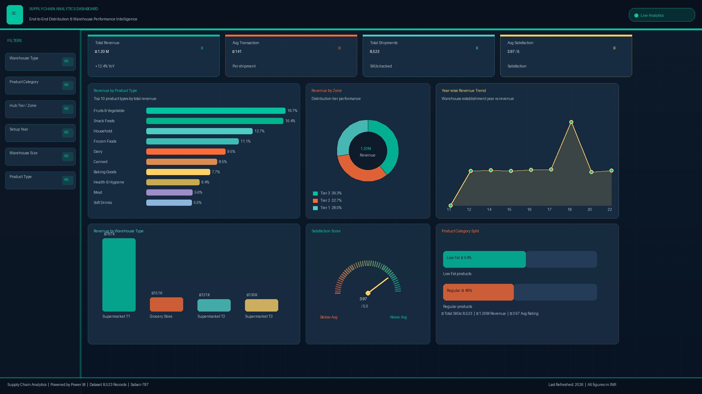

<div align="center">


# 🚚 Supply Chain Analytics — End-to-End BI Project

**A complete, production-grade supply chain analytics project** spanning data cleaning, SQL KPI extraction, Python EDA with validated assertions, a standalone ETL pipeline, and an interactive Power BI dashboard — built on real-world inspired logistics and multi-tier distribution data.

</div>

---

## 📊 Dashboard Preview

> *Interactive Power BI dashboard — filter by warehouse type, product category, hub tier, and setup year*



---

## 📥 Dataset

The raw CSV data is hosted externally (kept out of the repo to follow GitHub best practices).

| File | Rows | Description |
|------|------|-------------|
| `supply_chain_data.csv` | 8,523 | Raw dataset — download and place in `data/` |
| `supply_chain_cleaned.csv` | 8,523 | Generated automatically by `scripts/etl.py` |

> **Download:** [Google Drive / Kaggle link — add your link here]
>
> After downloading, place the file at `data/supply_chain_data.csv` before running the ETL or notebook.

---

## 📁 Project Structure

```
Supply-Chain-Analytics/
│
├── 📊 SupplyChain_Excel_Dashboard.xlsx       # Excel pivot dashboard with slicers
├── 🗄️  SupplyChain_SQL_Query.sql              # Full SQL analysis with cleaning & advanced queries
├── 🐍 SupplyChain_Analysis.ipynb             # Python EDA — clean theme, assertions, insights
├── 📈 SupplyChain_PowerBI_Dashboard.pbit     # Power BI template (open in Power BI Desktop)
├── 🖼️  SupplyChain_PowerBI_Dashboard.png     # Dashboard screenshot
├── 📄 requirements.txt                       # Python dependencies
├── 🚫 .gitignore                             # Git exclusions (CSV files excluded)
│
├── 📁 data/
│   ├── supply_chain_data.csv                 # ⬇️ Download separately (see Dataset section)
│   └── supply_chain_cleaned.csv             # Generated by scripts/etl.py
│
├── 📁 scripts/
│   └── etl.py                               # Standalone ETL pipeline with validation
│
└── 📁 docs/
    ├── schema.sql                            # CREATE TABLE DDL + BULK INSERT guide
    └── *.png                                 # Chart exports from notebook
```

---

## 📦 Dataset Overview

Multi-tier distribution network with inventory, shipment, and warehouse performance data across **8,523 transactions** and **28 warehouses**.

| Column | Type | Description |
|--------|------|-------------|
| `product_category` | Categorical | `Low Fat` / `Regular` |
| `product_identifier` | String | Unique SKU / product code |
| `product_type` | Categorical | 16 types (Fruits & Veg, Dairy, Household, etc.) |
| `warehouse_setup_year` | Integer | Year warehouse was established (2011–2022) |
| `warehouse_identifier` | String | Unique warehouse ID (OUT001–OUT028) |
| `hub_location_tier` | Categorical | `Tier 1` / `Tier 2` / `Tier 3` |
| `warehouse_size` | Categorical | `Small` / `Medium` / `High` (has nulls → imputed) |
| `warehouse_type` | Categorical | `Supermarket Type1/2/3` / `Grocery Store` |
| `product_visibility` | Float | Shelf visibility index 0–1 (zero = anomaly) |
| `product_weight` | Float | Weight in kg (has nulls → imputed by group median) |
| `sales` | Float | Revenue per transaction in INR |
| `rating` | Float | Satisfaction score 1–5 |

---

## 🛠️ Tools & Technologies

| Tool | Purpose |
|------|---------| 
| 📊 **Microsoft Excel 365** | Pivot tables, charts, interactive slicers, KPI scorecard |
| 🗄️ **SQL Server (T-SQL)** | Schema DDL, data cleaning, KPI aggregation, window functions |
| 🐍 **Python 3.10+** | ETL pipeline, EDA, validation assertions, visualizations |
| 📈 **Power BI Desktop** | Final interactive BI dashboard (`.pbit` template) |

---

## 🚀 Quick Start

### 1. Clone the repository
```bash
git clone https://github.com/sasikumar2004/Supply-Chain-Analytics-Excel-Sql-Python-Powerbi.git
cd Supply-Chain-Analytics-Excel-Sql-Python-Powerbi
```

### 2. Download the dataset
Download `supply_chain_data.csv` from the link above and place it in the `data/` folder.

### 3. Install Python dependencies
```bash
pip install -r requirements.txt
```

### 4. Run the ETL pipeline (cleans data + validates)
```bash
python scripts/etl.py
```

### 5. Launch the Python EDA notebook
```bash
jupyter lab SupplyChain_Analysis.ipynb
```

### 6. Run SQL analysis
```sql
-- In SQL Server Management Studio:
-- Step 1: Run docs/schema.sql  (creates table + indexes)
-- Step 2: BULK INSERT data/supply_chain_data.csv  (see schema.sql comments)
-- Step 3: Run SupplyChain_SQL_Query.sql
```

### 7. Open Power BI Dashboard
1. Install [Power BI Desktop](https://powerbi.microsoft.com/en-us/desktop/) (free)
2. Open `SupplyChain_PowerBI_Dashboard.pbit`
3. Point the data source to `SupplyChain_Excel_Dashboard.xlsx` when prompted

---

## 🗄️ SQL Highlights

The script covers 6 sections and **20+ queries** with T-SQL best practices:

| Section | Queries |
|---------|---------|
| Data Quality Checks | Null counts, casing fixes, assertion checks, outlier detection |
| Overall KPIs | Revenue, avg transaction, shipments, satisfaction, warehouse metrics |
| Product Analysis | Revenue by type/category, top 10 SKUs, visibility bucket analysis |
| Warehouse Analysis | By type, size, establishment year, individual ranking |
| Hub Tier Analysis | By zone, Hub×Category cross-tab, PIVOT table |
| Advanced | Running totals, YoY growth (LAG), percentile ranking (NTILE), moving average, performance tier classification |

**Sample — Performance Tier Classification:**
```sql
CASE
    WHEN w.Avg_Revenue >= o.Global_Avg * 1.15 THEN 'High Performer'
    WHEN w.Avg_Revenue >= o.Global_Avg        THEN 'Above Average'
    WHEN w.Avg_Revenue >= o.Global_Avg * 0.85 THEN 'Below Average'
    ELSE                                           'Under Performer'
END AS Performance_Tier
```

---

## 🐍 Python EDA Highlights

### Cleaning steps (all validated with `assert`)
- `Product_Category` casing standardised → asserted exactly 2 unique values
- `Product_Weight` nulls imputed by product-type group median → asserted 0 nulls remain
- `Warehouse_Size` nulls filled with mode → asserted 0 nulls remain
- Revenue validated: asserted no zero or negative values

### Visualizations (saved to `docs/`)
- KPI Cards (Total Revenue, Avg Transaction, Shipments, Satisfaction)
- Revenue by Product Type (16 categories, ranked)
- Warehouse Type bar + Size pie chart
- Hub Tier dual-axis analysis (total vs. avg revenue)
- Year-wise trend with annotated data points
- Correlation heatmap
- Revenue distribution (histogram + boxplot + scatter)
- Top 10 products + satisfaction rating comparison

---

## 📈 Power BI DAX Measures

| Measure | DAX |
|---------|-----|
| `Total Revenue` | `SUM(supply_chain[sales])` |
| `Avg Transaction Value` | `AVERAGE(supply_chain[sales])` |
| `Total Shipments` | `COUNTROWS(supply_chain)` |
| `Avg Satisfaction Score` | `AVERAGE(supply_chain[rating])` |
| `Revenue Share %` | `DIVIDE(SUM(...), CALCULATE(SUM(...), ALL(...)))` |
| `Total Warehouses` | `DISTINCTCOUNT(supply_chain[warehouse_identifier])` |
| `Avg Revenue per Warehouse` | `DIVIDE([Total Revenue], [Total Warehouses])` |
| `Low Fat Revenue %` | `DIVIDE(CALCULATE(SUM(...), Category="Low Fat"), SUM(...))` |
| `MoM Revenue %` | `DIVIDE([Total Revenue] - [Prev Month Revenue], [Prev Month Revenue])` |
| `YTD Revenue` | `CALCULATE([Total Revenue], DATESYTD(dim_date[full_date]))` |
| `Rolling 3M Avg` | `CALCULATE([Total Revenue], DATESINPERIOD(..., -3, MONTH))` |

---

## 📌 Key Business Insights

| # | Insight | Finding | Recommended Action |
|---|---------|---------|-------------------|
| 1 | **Top Revenue Categories** | Fruits & Vegetables (18.7%) and Snack Foods (16.4%) lead | Prioritize cold-chain and impulse-buy SKU procurement |
| 2 | **Warehouse Dominance** | Supermarket Type 1 generates ~65% of all revenue | Focus OpEx investment here; benchmark other types against it |
| 3 | **Geographic Revenue** | Tier 3 contributes ~39% — highest of all zones | Expand Tier 3 distribution capacity |
| 4 | **Visibility Paradox** | Very low and very high visibility items both underperform | Maintain product visibility in 0.03–0.12 range |
| 5 | **2018 Revenue Spike** | Warehouses established in 2018 outperform avg by ~57% | Investigate 2018 operational or network changes and replicate |
| 6 | **Category Split** | Low Fat drives ~64.6% of revenue vs 35.4% for Regular | Increase Low Fat SKU assortment in all warehouse types |
| 7 | **Satisfaction Plateau** | Overall rating ~3.97/5 — low variance across product types | Systemic issues (delivery, packaging) more likely than product-specific ones |
| 8 | **Warehouse Age Effect** | Newer warehouses show higher avg revenue per shipment | Network modernisation has measurable ROI |

---

## 📋 Requirements

| Tool | Minimum |
|------|---------|
| Python | 3.8+ |
| Microsoft Excel | 2016+ |
| SQL Server | 2014+ (T-SQL syntax) |
| Power BI Desktop | 2022+ recommended — [Download free](https://powerbi.microsoft.com/en-us/desktop/) |

---

## 📄 License

This project is licensed under the [MIT License](LICENSE) — feel free to use, modify, and share with attribution.

---

## 📬 Contact

📧 **Email:** sasikumar2004@gmail.com  
🌐 **GitHub:** [github.com/sasikumar2004](https://github.com/sasikumar2004)

---

<div align="center">

⭐ **If this project helped you, consider giving it a star!** ⭐

</div>
